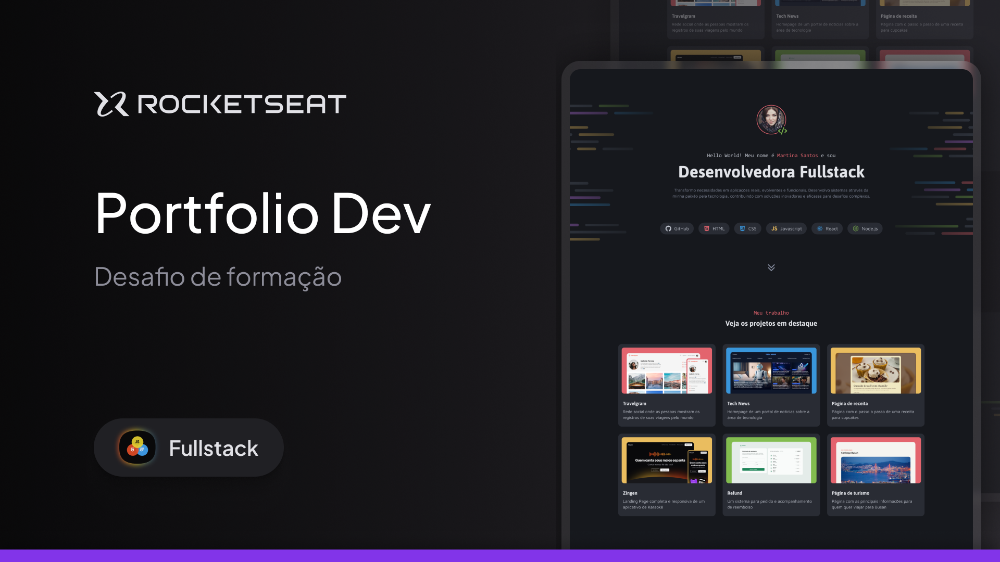

<h1 align="center">
  Portfólio Dev
</h1>

## Projeto

O projeto é um site desktop de portfólio para desenvolvedores, com links para projetos e contato do profissional.

Esse é um dos desafios práticos da formação Fullstack, um dos conteúdos disponíveis para alunos da Rocketseat.

## Tecnologias

Esse projeto foi desenvolvido com as seguintes tecnologias

- HTML
- CSS

---

## Acessar o Projeto

Para acessar o projeto, basta clicar neste link abaixo:  
<a href="https://pduartesilva2005.github.io/portfolio-dev/" target="_blank">Ver o projeto online!</a>

Criado por Pedro Duarte
